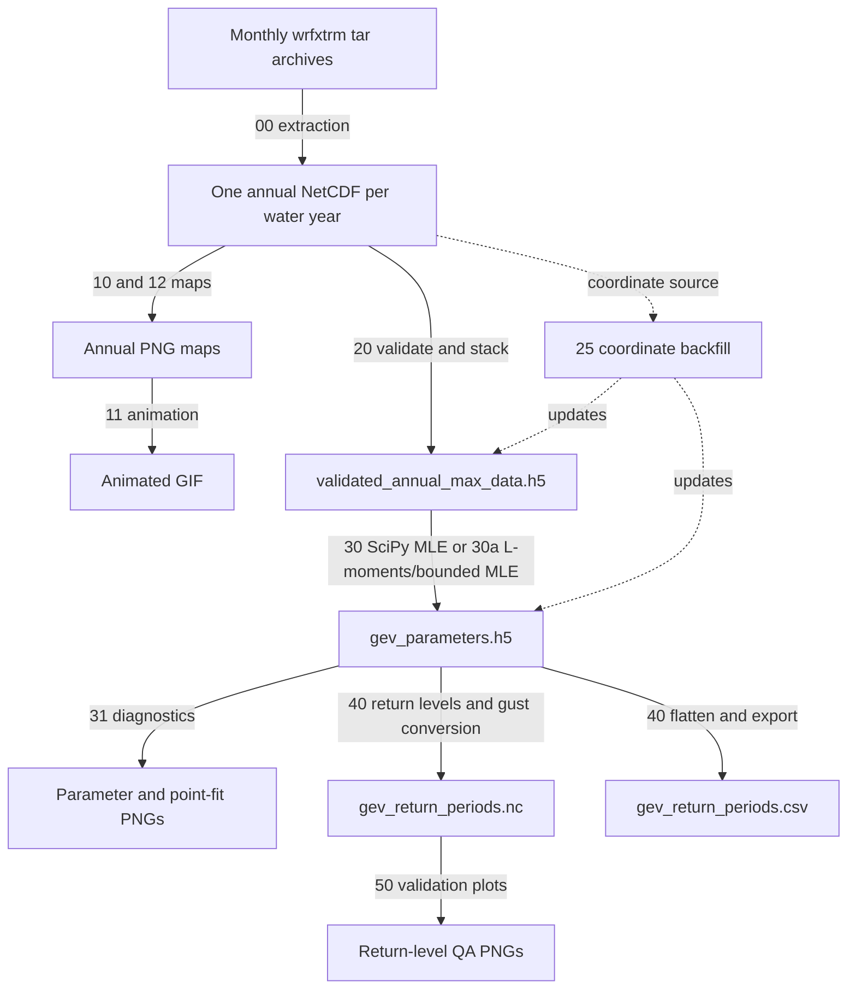

# CONUS404 Wind-Extreme Processing: Enhanced Repository Guide

This repository converts CONUS404 `wrfxtrm` daily 10 m wind-speed maxima into
annual block maxima, fits a Generalized Extreme Value (GEV) distribution at
every model grid cell, estimates multi-year return levels, converts native
model-time-step wind speeds to 3-second engineering gusts, and produces maps,
tables, diagnostics, and animations.

This guide documents the repository as it exists on July 31, 2026. It is based
on a line-by-line review of the 6,176 lines of authored Python, Markdown,
JavaScript, CSV, text, and XML content in the workspace. Large NetCDF, HDF5,
GeoJSON coordinate arrays, PNG, and GIF payloads were reviewed through their
schemas, metadata, dimensions, properties, and representative files rather
than reproduced byte for byte.

## Contents

1. [Project at a glance](#project-at-a-glance)
2. [Data provenance and scientific scope](#data-provenance-and-scientific-scope)
3. [End-to-end workflow](#end-to-end-workflow)
4. [Installation and dependencies](#installation-and-dependencies)
5. [How to run the repository](#how-to-run-the-repository)
6. [Detailed script reference](#detailed-script-reference)
7. [Data models and file schemas](#data-models-and-file-schemas)
8. [Statistical methods](#statistical-methods)
9. [Coordinate handling](#coordinate-handling)
10. [Visualization system](#visualization-system)
11. [Tests and current verification status](#tests-and-current-verification-status)
12. [Repository inventory](#repository-inventory)
13. [Known limitations and inconsistencies](#known-limitations-and-inconsistencies)
14. [Troubleshooting](#troubleshooting)
15. [References](#references)

## Project at a glance

| Item | Current repository value |
|---|---|
| Primary variable | `SPDUV10MAX`, daily maximum 10 m wind speed |
| Input units | m/s |
| Temporal aggregation | One maximum per water year per grid cell |
| Water years present | 1980-2024, 45 annual files |
| Grid | 1,015 south-north by 1,367 west-east |
| Grid cells | 1,387,505 |
| Nominal resolution | 4 km |
| Grid type | Lambert Conformal source grid represented by 2D WGS84 latitude/longitude |
| GEV fit choices | Unbounded SciPy MLE or L-moments with bounded-MLE fallback |
| Return periods | 10, 25, 50, 100, 200, and 500 years |
| Reported interval | 95% heuristic delta-style interval |
| Native duration assumption | 20-second CONUS404 model time step |
| Engineering product | 3-second gust using Durst factor 1.1176 |
| Main spatial export | NetCDF4 |
| Main tabular export | CSV, one row per grid cell |

The checked workspace currently contains:

| Artifact | Observed content | Approximate size |
|---|---|---:|
| `year_raw_data/` | 45 annual NetCDF files | 651 MB |
| `output/validated_annual_max_data.h5` | 45-year annual-max cube and coordinates | 210 MB |
| `output/gev_parameters.h5` | Four fitted-parameter/status grids and coordinates | 22 MB |
| `output/return_periods/gev_return_periods.nc` | Native and gust return-level grids | 290 MB |
| `output/return_periods/gev_return_periods.csv` | Flattened native and gust results | 526 MB |
| `presentation/` | Three prepared GIF animations | 30 MB |

The current parameter file reports 1,387,505 converged fits and zero failed
fits. Its `fit_method` attribute is `L-Moments / Natural Bounded MLE`, indicating
that it was produced by [30a_fit_gev_parameters.py](30a_fit_gev_parameters.py),
not the standard fitter selected by the orchestrator.

## Data provenance and scientific scope

The source is CONUS404 version 3.0, a 4 km Weather Research and Forecasting
(WRF) regional hydroclimate reanalysis. The repository metadata identifies:

- Temporal coverage: October 1, 1979 through September 30, 2024, expressed as
  water years 1980-2024.
- Spatial extent: approximately 20.11 to 52.90 degrees north and -131.16 to
  -63.12 degrees east longitude, including areas outside the contiguous United
  States needed for transboundary basins.
- Model: WRF 3.9.1.1 with ERA5 forcing and modified Noah-MP land-surface
  physics, among other CONUS404 configuration choices.
- Release DOI: <https://doi.org/10.5066/P9PHPK4F>.
- Repository data source page:
  <https://www.sciencebase.gov/catalog/item/6372cd09d34ed907bf6c6ab1>.
- Globus access portal:
  <https://app.globus.org/file-manager?origin_id=12aeed7a-9693-4f99-9816-96911c1322d2&origin_path=%2F&two_pane=true>.

The authoritative local metadata is in
[Data_Info/CONUS404_v3.0_metadata.xml](Data_Info/CONUS404_v3.0_metadata.xml),
with release changes in
[Data_Info/Version_History.txt](Data_Info/Version_History.txt) and the source
variable catalog in
[Data_Info/wrfxtrm_datadictionary.csv](Data_Info/wrfxtrm_datadictionary.csv).

`SPDUV10MAX` is the only `wrfxtrm` variable used by the active statistical
pipeline. The local source dictionary contains 37 data/time variables covering
2 m water-vapor mixing ratio, convective and grid-scale precipitation flux,
skin temperature, 2 m air temperature, scalar 10 m wind speed, grid-relative
10 m U/V wind components, occurrence times for extrema, and the model-time
string.

## End-to-end workflow

The filename prefixes imply phases `00`, `10`, `20`, `30`, `40`, and `50`.
Several script docstrings instead call validation "Phase 1," fitting "Phase 2,"
and export "Phases 3 & 4." This guide uses the filename prefixes because they
are unambiguous.



### Phase 00: annual block-max extraction

For a single configured water year, the extraction script opens each matching
monthly tar archive, sanitizes colons in extracted member names, discovers
`wrfxtrm_d01_*` files, and updates a running cell-by-cell maximum of
`SPDUV10MAX`. It reads authoritative coordinates from the source when possible
and computes a Lambert Conformal fallback otherwise.

### Phase 10: annual-map production and animation

The full-domain and Durham-focused map scripts read every annual NetCDF,
convert m/s to mph with factor `2.23694`, plot the raw 4 km cells, and save one
PNG per year. The GIF script sorts full-domain PNGs by the four-digit year and
writes a looping 500 ms-per-frame animation.

### Phase 20: validation and consolidation

All annual files are checked for a usable `SPDUV10MAX` field, valid 2D
coordinates, compatible dimensions, matching coordinate values, NaNs, and
implausible values. Accepted years are stacked into a float32 HDF5 cube ordered
by year.

### Phase 30: grid-cell GEV fitting

Each grid cell contributes a time series of up to 45 annual maxima. A GEV is
fit independently at every cell using all CPU cores. The scripts write 2D
location, scale, SciPy-shape, and convergence grids. The active fit scripts do
not write intermediate checkpoints despite comments in older documentation.

### Phase 40: return levels and export

For each converged cell, the exporter calculates six native return levels and
interval bounds, applies the deterministic Durst conversion to create parallel
3-second gust products, then writes NetCDF and CSV outputs. It verifies
monotonicity and exact gust-factor consistency after export.

### Phase 50: return-level visual QA

The validation script currently creates a 100-year native return-level map, a
100-year interval-width map, and return-level curves for three reproducibly
sampled valid grid points.

## Installation and dependencies

The repository does not include `requirements.txt`, `pyproject.toml`, Conda
metadata, or a JavaScript package manifest. Create an environment manually:

```bash
python -m venv .venv
source .venv/bin/activate
python -m pip install --upgrade pip
python -m pip install numpy netCDF4 h5py scipy pandas xarray matplotlib geopandas imageio plotly pyproj lmoments3
```

Core analysis dependencies:

| Package | Use |
|---|---|
| NumPy | Arrays, masks, extrema, and numerical calculations |
| netCDF4 | Annual NetCDF input and return-period NetCDF output |
| h5py | Intermediate and parameter HDF5 products |
| SciPy | GEV fitting, optimization, density, and quantile functions |
| pandas | Final CSV assembly and export |

Optional or visualization dependencies:

| Package | Use |
|---|---|
| lmoments3 | Preferred fit attempted by `30a_fit_gev_parameters.py` |
| pyproj | Only needed by Phase 00 when source coordinates are missing |
| xarray | Annual-map readers |
| Matplotlib | Active maps and diagnostic plots |
| GeoPandas | Natural Earth and local GeoJSON overlays |
| imageio | GIF creation |
| Plotly | Shared theme helper; not used by the main pipeline |
| Cartopy, rasterio, GDAL | Archived inspection and mapping prototypes only |

`10_image_creation.py` fetches Natural Earth state boundaries at runtime, so
that script needs network access for the overlay. It continues without the
overlay if the request fails.

## How to run the repository

Run all commands from the repository root. The existing annual NetCDF files
mean most users can begin at validation rather than re-extracting source tars.

### Inspect the current tests

```bash
source .venv/bin/activate
python -m unittest discover -s tests -v
```

See [Tests and current verification status](#tests-and-current-verification-status)
before treating the current suite as green.

### Run the active core path

```bash
python 20_validate_annual_max_files.py

# Choose exactly one fitter; both overwrite output/gev_parameters.h5.
python 30_fit_gev_parameters.py
# or
python 30a_fit_gev_parameters.py

python 31_gev_validation.py
python 40_calculate_return_periods.py
python 50_validation_return_periods.py
```

The validation, fitting, diagnostic, return-period, and Phase 50 scripts contain
absolute paths rooted at this repository's current macOS location. They work in
the checked workspace but must be edited for another clone location. Phase 40
accepts a different `base_dir` only when imported and called from Python:

```python
import importlib.util
from pathlib import Path

script = Path("40_calculate_return_periods.py")
spec = importlib.util.spec_from_file_location("return_periods", script)
module = importlib.util.module_from_spec(spec)
spec.loader.exec_module(module)
module.main("/path/to/output")
```

### Use the orchestrator

```bash
python run_all_phases.py
```

The orchestrator runs only:

1. `20_validate_annual_max_files.py`
2. `30_fit_gev_parameters.py`
3. `40_calculate_return_periods.py`

It does not run extraction, maps, GIF creation, coordinate backfill, the `30a`
fitter, GEV diagnostics, return-period validation plots, or tests. It uses the
current Python interpreter, stops on the first nonzero exit, and imposes a
one-hour timeout on each child process.

### Backfill coordinates into older HDF5 products

```bash
python 25_backfill_coordinates.py
```

Defaults:

- Source: `year_raw_data/water_year_1980/wrfxtrm_d01_max_spduv10max_1980.nc`
- Targets: `output/validated_annual_max_data.h5` and
  `output/gev_parameters.h5`
- Backup: enabled, with suffix `.coordinate-backup`
- Existing matching coordinates: no change
- Existing conflicting coordinates: error unless `--overwrite` is supplied

Custom usage:

```bash
python 25_backfill_coordinates.py \
  --source year_raw_data/water_year_1980/wrfxtrm_d01_max_spduv10max_1980.nc \
  --targets output/validated_annual_max_data.h5 output/gev_parameters.h5
```

Use `--no-backup` only when an external backup already exists. Use
`--overwrite` only after independently verifying that the selected annual file
is the authoritative grid for every target.

### Produce annual maps and GIFs

```bash
python 10_image_creation.py
python 12_image_creation.py
python 11_gif_creator.py
```

The GIF script reads `output/max_wind_speed_conus_*.png` but writes
`conus_max_wind_speed_1980_2024.gif` in the repository root, not in `output/` or
`presentation/`.

### Re-run Phase 00 for a water year

[00_extract_max_wind_speed_yearly.py](00_extract_max_wind_speed_yearly.py) has
no command-line interface and is hardcoded for water year 1981 using a Windows
path. Before running it, edit `raw_data_dir`, `extract_dir`, `output_file`, and
the fixed `1981` title in `create_output_netcdf()`. Process only trusted tar
archives because extraction uses Python's direct tar-member extraction.

## Detailed script reference

### Active processing scripts

#### [00_extract_max_wind_speed_yearly.py](00_extract_max_wind_speed_yearly.py)

- Finds `wrfxtrm_conusii_*.tar` in one configured water-year directory.
- Extracts one archive at a time and deletes extracted `wrfxtrm_d01_*` files
  after updating the running maximum.
- Handles 2D data or selects index zero from 3D `SPDUV10MAX`.
- Reads coordinates in `lat_2d/lon_2d`, `XLAT/XLONG`, then `lat/lon` priority.
- Uses a spherical Lambert Conformal fallback with 4,000 m spacing,
  true latitudes 30 and 50 degrees, center 39.1 N and -97.9 E, and radius
  6,370,000 m.
- Requires identical dimensions and coordinate values across source files.
- Logs and skips individual files on any exception.
- Writes compressed float32 `SPDUV10MAX` plus 2D coordinates using CF-1.7
  metadata.

#### [10_image_creation.py](10_image_creation.py)

- Executes at import time; it is not wrapped in `main()`.
- Reads every annual file and searches for coordinates and a wind-like field.
- Uses an approximate rectangular coordinate fallback if no coordinates exist.
- Converts to mph and fixes the displayed range to 25-65 mph.
- Plots the CONUS viewport from -126 to -66 longitude and 23 to 50 latitude.
- Downloads Natural Earth state/province geometry and filters US records.
- Writes `output/max_wind_speed_conus_YYYY.png` at 150 dpi.
- Continues to the next annual file after an exception.

#### [11_gif_creator.py](11_gif_creator.py)

- Sorts full-CONUS PNGs by a `conus_YYYY.png` filename pattern.
- Reads all frames into memory before writing.
- Skips unreadable frames and aborts if none remain.
- Writes an infinitely looping GIF with a 500 ms frame duration.

#### [12_image_creation.py](12_image_creation.py)

- Shares the annual reader, unit conversion, color scale, and import-time
  execution pattern of Phase 10.
- Loads Durham County and all North Carolina county polygons from `geo/`.
- Centers the viewport at 35.9940 N, -78.8986 E with 0.5-degree latitude and
  1.25-degree longitude padding.
- Writes `output/max_wind_speed_durham_YYYY.png` at 150 dpi.

#### [20_validate_annual_max_files.py](20_validate_annual_max_files.py)

- Discovers annual files under `year_raw_data/water_year_*`.
- Accepts a 2D `SPDUV10MAX` field or a 3D field with one leading time sample.
- Requires finite, in-range, 2D latitude and longitude coordinates.
- Warns on NaNs, negative speeds, and speeds above 100 m/s.
- Uses the first valid file as the reference grid and rejects later shape or
  coordinate mismatches.
- Orders accepted data by the year parsed from each filename.
- Holds individual arrays in a dictionary and then copies them into the final
  float32 cube, so peak memory exceeds the cube size alone.
- Writes gzip level 4 HDF5 data, coordinate provenance, years, dimensions,
  units, and a year-to-index attribute group.

#### [25_backfill_coordinates.py](25_backfill_coordinates.py)

- Is the only active processing script with a complete command-line interface.
- Determines target shape from HDF5 attributes, `location`, or `spduv10max`.
- Refuses shape mismatches and, by default, coordinate conflicts.
- Is idempotent when existing coordinates match within `1e-5` degrees.
- Creates at most one `.coordinate-backup` per target unless backup is disabled.

#### [30_fit_gev_parameters.py](30_fit_gev_parameters.py)

- Loads the entire validated cube and coordinate grids into memory.
- Builds a Python tuple for every grid index.
- Uses `multiprocessing.Pool(cpu_count())` and unordered chunks of 100 cells.
- Removes NaNs and requires at least three annual values.
- Calls `scipy.stats.genextreme.fit` with no explicit parameter bounds.
- Treats any positive scale as converged; optimizer diagnostics are not
  separately captured.
- Allocates a warning object grid in memory but does not write it to HDF5.
- Prints progress every 50,000 completed cells.
- Writes the final result only after all cells finish; there is no checkpoint or
  resume support.

#### [30a_fit_gev_parameters.py](30a_fit_gev_parameters.py)

- Has the same data flow, multiprocessing strategy, output path, and lack of
  checkpoints as the standard fitter.
- Attempts `lmoments3.distr.gev.lmom_fit` for each cell when installed.
- Falls back per cell to L-BFGS-B minimization of `genextreme.nnlf`.
- Bounds SciPy `c` to `[-0.5, 0.5]`, leaves location unbounded, and enforces a
  minimum scale of `0.001`.
- If `lmoments3` is absent, every cell uses bounded MLE.
- Always writes `fit_method = L-Moments / Natural Bounded MLE`, so the metadata
  does not record the per-cell method or whether L-moments was installed.

#### [31_gev_validation.py](31_gev_validation.py)

- Reads the parameter HDF5 and validated annual cube from absolute paths.
- Produces percentile-trimmed location/scale heatmaps and a fixed `[-0.5, 0.5]`
  SciPy-shape heatmap.
- Produces a binary convergence map and parameter histograms.
- For three deterministic domain positions, overlays an empirical histogram
  with the fitted GEV PDF and makes a Q-Q plot using Weibull positions
  `i / (n + 1)`.
- Saves `diagnostic_heatmaps.png`, `diagnostic_convergence.png`,
  `diagnostic_histograms.png`, and `diagnostic_points.png` in the repository
  root, then displays figures interactively.

#### [40_calculate_return_periods.py](40_calculate_return_periods.py)

- Reads all parameter and coordinate grids into memory.
- Calculates native estimates and bounds with nested Python loops over every
  row, column, and return period.
- Skips cells whose `converged` value is false.
- Stores 18 native 2D arrays and then 18 converted arrays in dictionaries.
- Writes six dimensioned native/gust variables plus 18 native per-period
  compatibility variables to NetCDF.
- Flattens every 2D field into Python lists before constructing the CSV
  DataFrame, which creates substantial peak memory pressure.
- Writes NetCDF result variables without compression.
- Checks monotonic native estimates and exact deterministic conversion after
  export, but warnings do not cause a nonzero exit.

#### [50_validation_return_periods.py](50_validation_return_periods.py)

- Reads only the legacy native `rp_R_*` compatibility variables.
- Plots arrays in grid-index space rather than using the 2D geographic
  coordinates.
- Caps the uncertainty-map color scale at the 98th percentile while printing
  the uncapped minimum, mean, and maximum interval widths.
- Uses NumPy seed 42 to choose up to three valid points.
- Currently invokes spatial and uncertainty maps only for the 100-year period.
- Saves plots under `output/return_periods/visualizations/`.

### Shared modules and orchestration

#### [coordinate_utils.py](coordinate_utils.py)

Provides coordinate normalization, NetCDF/HDF5 readers, grid comparison, and
HDF5 writing. See [Coordinate handling](#coordinate-handling).

#### [run_all_phases.py](run_all_phases.py)

Runs validation, the unbounded-MLE fitter, and export as subprocesses using the
same interpreter. It resolves script paths relative to itself, so the
orchestrator itself does not contain a hardcoded Windows base path.

#### [plotly_standard_graphic_engine.py](plotly_standard_graphic_engine.py)

Defines and globally registers a white-background Plotly template with CADENCE
colors, Inter typography, light grid lines, and fixed margins. Importing the
module changes Plotly's process-wide default template to `cadence_theme`.

#### [theme.js](theme.js)

Exports a Tailwind-style theme extension containing CIRCAD color tokens, an
Inter-first sans-serif stack, and `expo-out` and `quart-out` transition curves.
There is no JavaScript application or package configuration in this repository
that consumes it directly.

## Data models and file schemas

### Existing annual-max NetCDF files

Representative 1980 and 2024 files have the same observed schema:

| Object | Dimensions | Type | Meaning |
|---|---|---|---|
| `lat` | `(lat=1015)` | float32 | Legacy 1D latitude axis |
| `lon` | `(lon=1367)` | float32 | Legacy 1D longitude axis |
| `lat_2d` | `(y=1015, x=1367)` | float32 | Authoritative curvilinear latitude |
| `lon_2d` | `(y=1015, x=1367)` | float32 | Authoritative curvilinear longitude |
| `SPDUV10MAX` | `(lat=1015, lon=1367)` | float32 | Annual maximum daily 10 m wind speed |

The existing files are CF-1.7 and describe creation across 12 monthly tar
archives. This schema differs from the current Phase 00 writer, which would
create only `south_north` and `west_east` dimensions and put all three fields on
those dimensions. Downstream code works with the checked files because it
prioritizes `lat_2d/lon_2d` and validates by array shape rather than dimension
names.

### Validated annual-max HDF5

Observed `output/validated_annual_max_data.h5` schema:

| Dataset/group | Shape | Type/compression | Meaning |
|---|---:|---|---|
| `spduv10max` | `(45, 1015, 1367)` | float32, gzip | Ordered annual maxima |
| `lat_2d` | `(1015, 1367)` | float32, gzip | Grid-cell latitude |
| `lon_2d` | `(1015, 1367)` | float32, gzip | Grid-cell longitude |
| `years` group | 45 attributes | HDF5 group | `year_YYYY` to zero-based index |

Important root attributes include `years=1980..2024`, `num_years=45`, grid
dimensions, `variable_name=SPDUV10MAX`, `units=m/s`, `coordinate_grid=curvilinear`,
coordinate source, and validation timestamp.

### GEV parameter HDF5

Observed `output/gev_parameters.h5` schema:

| Dataset | Shape | Type/compression | Meaning |
|---|---:|---|---|
| `location` | `(1015, 1367)` | float32, gzip | GEV location in m/s |
| `scale` | `(1015, 1367)` | float32, gzip | GEV scale in m/s |
| `shape` | `(1015, 1367)` | float32, gzip | SciPy `c`, not conventional `xi` |
| `converged` | `(1015, 1367)` | int8, gzip | 1 for accepted fit, 0 otherwise |
| `lat_2d` | `(1015, 1367)` | float32, gzip | Latitude |
| `lon_2d` | `(1015, 1367)` | float32, gzip | Longitude |

Root attributes record grid dimensions, `num_years`, fit timestamp, fit method,
counts, coordinate grid, and coordinate provenance. Warning text, sample counts,
optimizer status, objective values, standard errors, and parameter covariance
matrices are not retained.

### Return-period NetCDF

Observed `output/return_periods/gev_return_periods.nc` dimensions:

| Dimension | Length |
|---|---:|
| `return_period` | 6 |
| `south_north` | 1,015 |
| `west_east` | 1,367 |

Coordinate and primary variables:

| Variable | Dimensions | Meaning |
|---|---|---|
| `return_period` | `(return_period)` | `[10, 25, 50, 100, 200, 500]` years |
| `lat` | `(south_north, west_east)` | 2D latitude |
| `lon` | `(south_north, west_east)` | 2D longitude |
| `wind_speed_native` | `(return_period, south_north, west_east)` | Native estimate |
| `wind_speed_native_lower_ci` | same | Native lower bound |
| `wind_speed_native_upper_ci` | same | Native upper bound |
| `wind_speed_3sec_gust` | same | 3-second gust estimate |
| `wind_speed_3sec_gust_lower_ci` | same | Gust lower bound |
| `wind_speed_3sec_gust_upper_ci` | same | Gust upper bound |

For compatibility with Phase 50, each return period also has native 2D aliases:

```text
rp_R_estimate
rp_R_lower_ci
rp_R_upper_ci
```

The checked NetCDF is tagged CF-1.8 and contains duration, Durst, exposure,
coordinate-provenance, and uncertainty attributes. It does not currently
contain `lat_idx`, `lon_idx`, a `crs` variable, `grid_mapping` attributes, or
`geospatial_bounds_crs`, although the current export test expects them.

### Return-period CSV

The CSV contains one row for every `(lat_idx, lon_idx)` pair, for 1,387,505
rows total. Its 42 columns are:

- Four location/index fields: `lat_idx`, `lon_idx`, `latitude`, `longitude`.
- For each return period `R`: native `rp_R`, `rp_R_lower`, `rp_R_upper`.
- For each return period `R`: `rp_R_3sec_gust`,
  `rp_R_3sec_gust_lower`, `rp_R_3sec_gust_upper`.
- `gust_conversion_factor` and `converged`.

Use latitude/longitude for geographic work and preserve indices for exact
round-trips to the 2D arrays. A direct flattened-row lookup is:

$$
\text{row} = \text{lat\_idx} \times 1367 + \text{lon\_idx}.
$$

## Statistical methods

### Block maxima

At each grid cell, the sample consists of one annual maximum for each water
year. With the current data, the maximum available sample size is 45. Missing
values are removed independently by cell, and either fitter requires at least
three remaining observations.

This is a spatial collection of independent univariate fits. The scripts do
not model spatial dependence, temporal nonstationarity, climate trends, serial
correlation, tropical-cyclone regimes, or cross-cell covariance.

### GEV parameterization and sign convention

SciPy's `genextreme` uses shape parameter `c`. Much of the extreme-value
literature uses `xi` with the opposite sign:

$$
\xi = -c.
$$

Both fitting scripts store SciPy `c` in the HDF5 dataset named `shape` and pass
that value back to SciPy diagnostics. Therefore:

| Stored SciPy `c` | Conventional `xi` | Tail interpretation |
|---:|---:|---|
| `c > 0` | `xi < 0` | Bounded upper tail, Weibull type |
| `c = 0` | `xi = 0` | Gumbel |
| `c < 0` | `xi > 0` | Heavy upper tail, Frechet type |

Comments and labels in several scripts call the stored value `xi`; interpret
those labels cautiously.

### Return-level formula

For return period $R$, the non-exceedance probability is:

$$
p = 1 - \frac{1}{R}.
$$

The general formula implemented for stored SciPy shape $c \ne 0$ is:

$$
x_R = \mu + \frac{\sigma}{c}
\left[1 - \{-\ln(p)\}^{c}\right].
$$

Its continuous Gumbel limit is:

$$
x_R = \mu - \sigma\ln\{-\ln(p)\}.
$$

The current `gev_return_level()` near-zero branch uses a plus sign before the
last term, which is inconsistent with both SciPy's Gumbel quantile and the
$c \to 0$ limit of its own general branch. Cells with `abs(c) < 1e-6` can
therefore receive incorrect return levels, and the function is discontinuous
at that switch. This is a known implementation issue, not a scientific choice.

### Reported interval bounds

The code labels its bounds as a delta-method 95% confidence interval, but it
does not use an estimated parameter covariance matrix. Let
$y=-\ln(p)$ and $L=\ln(y)$. For nonzero $c$, it computes:

$$
d_\sigma = \frac{1-y^c}{c},
$$

$$
d_c = -\frac{1-y^c}{c^2} + \frac{y^cL}{c}.
$$

Near zero it substitutes:

$$
d_\sigma=-L, \qquad d_c=-\frac{1}{2}L^2.
$$

It then defines:

$$
SE = \frac{\sigma}{\sqrt{n}}
\sqrt{d_\sigma^2+d_c^2}\ln(R+1),
$$

and reports $x_R \pm 1.96SE$.

This is a heuristic delta-style approximation. It omits location uncertainty,
parameter variances and covariances from the fit, profile likelihood, bootstrap
sampling, and uncertainty in annual maxima. The `ln(R+1)` extrapolation factor
is an ad hoc widening term. Bounds are symmetric and are not clipped to
physically meaningful wind speeds.

### Native 20-second to 3-second gust conversion

Phase 40 applies the conversion only after calculating native return levels and
bounds:

$$
G_{20s\rightarrow3s} =
\operatorname{round}\left(\frac{1.52}{1.36},4\right)=1.1176,
$$

$$
V_{3s}(g,R)=1.1176V_{20s}(g,R).
$$

The 3-second coefficient is 1.52. The 20-second coefficient is 1.36, described
as a log-linear interpolation of empirical 10- and 30-second Durst values. The
same deterministic factor is applied to estimates and both bounds, with no
additional conversion uncertainty.

This adjustment does not correct terrain, exposure category, observation
height, model bias, grid-cell averaging, topographic resolution, climate
nonstationarity, or GEV model error. The code records a standard open-terrain
exposure convention and references ASCE 7 Commentary Figure C26.5-1.

## Coordinate handling

CONUS404 is a projected curvilinear grid. Geographic latitude and longitude are
2D auxiliary coordinates indexed by row and column; they must not be treated as
independent 1D rectilinear axes.

[coordinate_utils.py](coordinate_utils.py) enforces these rules:

1. Fill masked values with NaN and remove only leading singleton dimensions.
2. Require exactly 2D arrays after squeezing.
3. Require an expected shape when supplied.
4. Require all values to be finite.
5. Enforce latitude in `[-90, 90]` and longitude in `[-180, 180]`.
6. Cast coordinates to float32 without copying when possible.
7. Prefer NetCDF pairs in this order: `lat_2d/lon_2d`, `XLAT/XLONG`, then
   `lat/lon`.
8. Reject an incomplete pair rather than silently trying another convention.
9. Compare reference and candidate arrays with maximum absolute tolerance
   `1e-5` degrees.
10. Store HDF5 coordinates with gzip level 4, standard names, units,
    `coordinate_source`, and `coordinate_grid=curvilinear`.

The Phase 00 projection fallback assumes a spherical WRF Earth, while the
transformation destination and return-period metadata use WGS84. Embedded
source coordinates are preferred and should remain the authoritative grid.

## Visualization system

The repository includes a CADENCE/CIRCAD design system in
[CADENCE_Design_System.md](CADENCE_Design_System.md). Primary colors include:

| Token | Hex | Intended use |
|---|---|---|
| CADENCE teal | `#2F8F7F` | Brand and low-risk/primary data |
| CADENCE grey | `#333333` | Text and structure |
| CADENCE tan | `#D9A341` | Moderate risk and financial/aging values |
| CIRCAD blue | `#205196` | Water/flooding and secondary series |
| Light blue | `#6FA8DC` | Secondary data and uncertainty |
| Ice blue | `#E9ECEF` | Backgrounds and grids |
| CIRCAD red | `#AA2634` | Critical risk and failure |
| Purple | `#673399` | Additional categorical series |

The annual map scripts duplicate their Matplotlib theme locally rather than
importing a shared style. The GEV and return-period diagnostic scripts use
other Matplotlib palettes (`viridis`, `plasma`, `RdBu`, `turbo`, and `magma`),
so not every generated visualization follows CADENCE colors.

Geospatial overlays:

- [geo/DCo_Boundary.geojson](geo/DCo_Boundary.geojson) is a WGS84 Durham-area
  boundary feature used by the regional map.
- [geo/North_Carolina_State_and_County_Boundary_Polygons.geojson](geo/North_Carolina_State_and_County_Boundary_Polygons.geojson)
  contains North Carolina county polygons and county properties such as name,
  FIPS, survey status, dates, area, length, and identifiers.
- The full-CONUS map retrieves low-resolution Natural Earth US state/province
  polygons from a remote ZIP archive.

Prepared visual assets include four root-level GEV diagnostic PNGs, archived
prototype PNGs/GIFs, and full-CONUS, North Carolina, and Durham GIFs under
`presentation/`.

## Tests and current verification status

The repository uses Python's built-in `unittest` framework. The tests dynamically
load the numbered scripts because their filenames are not normal import names.

### Test coverage

[tests/test_coordinate_utils.py](tests/test_coordinate_utils.py) covers:

- Leading singleton-dimension normalization.
- Shape and geographic-range rejection.
- WRF `XLAT/XLONG` coordinate reading.
- Coordinate mismatch rejection.
- Incomplete coordinate-pair rejection.

[tests/test_backfill_coordinates.py](tests/test_backfill_coordinates.py) covers:

- Coordinate backfill and idempotence.
- Spatial-shape mismatch rejection.
- Conflicting existing-coordinate rejection.

[tests/test_calculate_return_periods.py](tests/test_calculate_return_periods.py)
covers:

- Exact use of rounded factor 1.1176 rather than the unrounded ratio.
- Array shape, dtype, NaN, and input preservation during gust conversion.
- A temporary 2 by 2 Phase 40 export, including native/gust values and metadata.

### Observed test result on July 31, 2026

```text
Ran 11 tests
10 passed
1 error
```

The failing test is
`Phase4ExportTests.test_exports_native_and_3sec_gust_products`. It raises
`KeyError: 'lat_idx'` because the test expects NetCDF `lat_idx` and `lon_idx`
variables that the current exporter does not create. The same test subsequently
expects a `crs` variable, `grid_mapping` attributes, coordinate text including
the index variables, and `geospatial_bounds_crs`; those expectations are also
absent from the current exporter and checked output.

There are no active tests for tar extraction, annual validation, either GEV
fitter, the return-level formula or its near-Gumbel limit, interval coverage,
monotonicity failure behavior, plotting, GIF generation, orchestration, real
full-grid files, or archive utilities.

## Repository inventory

### Root documentation and configuration

| Path | Role |
|---|---|
| [README.md](README.md) | Existing project overview; useful but contains stale phase/path/checkpoint claims |
| [Readme_enhanced.md](Readme_enhanced.md) | Audited guide to the current workspace |
| [SETUP_GUIDE.md](SETUP_GUIDE.md) | Python program stored with a Markdown extension; prints an older setup guide only when run by Python |
| [CADENCE_Design_System.md](CADENCE_Design_System.md) | Color, typography, chart, UI, and reporting guidance |
| [.gitignore](.gitignore) | Ignores `raw_data/`, `output/`, `.venv/`, and `__pycache__/` |

`SETUP_GUIDE.md` is not rendered documentation in the conventional sense. It
contains a Python triple-quoted `INSTRUCTIONS` value and a `__main__` block. Its
examples use old `raw_data/annual_max` paths, older unnumbered script names,
40-year language, and output paths that do not match the active workspace.

### Checks

| Path | Role/status |
|---|---|
| [checks/checks.py](checks/checks.py) | Opens one hardcoded raw WRF file, prints center/corner coordinates and projection metadata, and documents the expected fallback parameters |
| [checks/inspect_wrfxtrm.py](checks/inspect_wrfxtrm.py) | Prints dimensions, variables, and coordinate candidates for one hardcoded source file |

These are exploratory scripts, not automated assertions, and execute at import
time.

### Data information

| Path | Role |
|---|---|
| [Data_Info/CONUS404_v3.0_metadata.xml](Data_Info/CONUS404_v3.0_metadata.xml) | Full authoritative USGS metadata record |
| [Data_Info/Version_History.txt](Data_Info/Version_History.txt) | Version 1.0-3.0 release history and citation |
| [Data_Info/wrfxtrm_datadictionary.csv](Data_Info/wrfxtrm_datadictionary.csv) | `wrfxtrm` dimensions, coordinates, variables, units, and descriptions |

### Archived prototypes

Files under `Archive/` are historical or experimental and are not called by
the active pipeline:

| Path | Purpose and status |
|---|---|
| [Archive/extract_max_wind_speed.py](Archive/extract_max_wind_speed.py) | Earlier extraction/coordinate/output implementation, superseded by Phase 00 |
| [Archive/list_nc_files.py](Archive/list_nc_files.py) | Lists NetCDF files under `raw_data/` and reports XLAT/XLONG presence |
| [Archive/visual_inspection.py](Archive/visual_inspection.py) | Cartopy projection and state-overlay inspection for one hardcoded annual file |
| [Archive/visualize_max_wind_speed_simple.py](Archive/visualize_max_wind_speed_simple.py) | Single-year Matplotlib overview with approximate-coordinate fallback |
| [Archive/visualize_max_wind_speed_area_focus.py](Archive/visualize_max_wind_speed_area_focus.py) | Single-year full-domain and Durham-area exploration |
| [Archive/Example_Code/map_generator.py](Archive/Example_Code/map_generator.py) | Legacy class/procedural example for aggregation, GeoTIFF conversion, GDAL reprojection, and mapping with hardcoded shared-system paths |

The archive also contains generated maps and an earlier Durham GIF. These files
are useful provenance but are not reproducible through `run_all_phases.py`.

### Data and generated products

| Directory/path | Contents |
|---|---|
| `year_raw_data/water_year_1980` through `water_year_2024` | One annual-max NetCDF per water year |
| `output/` | Validated HDF5, GEV HDF5, coordinate backups, and return-period outputs |
| `output/return_periods/` | NetCDF, CSV, and visualization directory |
| `presentation/` | Three final GIF assets |
| `geo/` | Durham and North Carolina boundary GeoJSON |

`output/*.coordinate-backup` files are full pre-backfill copies. They are not
read by normal pipeline execution.

## Known limitations and inconsistencies

### Scientific and statistical

1. The near-zero-shape return-level branch has the wrong sign relative to
   SciPy's Gumbel quantile and the general branch's mathematical limit.
2. Reported intervals are not based on fitted parameter covariance and should
   not be interpreted as calibrated frequentist coverage.
3. GEV fits are independent and stationary at each cell; spatial dependence and
   temporal trends are not modeled.
4. The standard fitter has no shape bounds. The alternate fitter imposes bounds
   only on bounded-MLE fallbacks; L-moment outputs are not explicitly clipped.
5. A fit is marked converged mainly when a call returns a positive scale. Full
   optimizer diagnostics and goodness-of-fit thresholds are not retained.
6. Six return periods extend far beyond the 45-year record, especially 200 and
   500 years. Tail and model uncertainty dominate those estimates.
7. The deterministic Durst conversion does not model its own uncertainty or
   replace a complete engineering exposure, terrain, height, and model-bias
   treatment.

### Data and coordinates

1. Current annual files and the current Phase 00 writer use different dimension
   naming/layout conventions.
2. Phase 00 is configured only for water year 1981 and embeds that year in
   output metadata.
3. Visualization scripts can synthesize approximate rectangular coordinates,
   while the analysis pipeline correctly rejects missing 2D coordinates.
4. The output NetCDF identifies 2D latitude/longitude but lacks the CF index and
   CRS objects expected by the modified export test.
5. Phase 50 visualizes grid indices, not geographic coordinates or boundaries.

### Execution and performance

1. Most analysis scripts contain absolute paths and no CLI configuration.
2. Both fitters use every detected CPU core and offer no worker-count option.
3. Multiprocessing behavior and memory cost vary by operating system start
   method; the full annual cube may be duplicated or serialized to workers.
4. Fitters provide no checkpoint/restart behavior, despite stale comments to
   the contrary.
5. Phase 40 uses deeply nested loops, many full-grid arrays, Python lists for
   CSV construction, and uncompressed NetCDF output.
6. The orchestrator's one-hour timeout can terminate a valid long-running fit.
7. Several scripts suppress all warnings globally, which can hide numerical,
   deprecation, and geospatial warnings.
8. Map scripts, checks, and archive scripts perform work at import time.
9. There is no locked dependency specification or reproducible environment
   file.

### Documentation and naming

1. Phase numbering differs among filenames, docstrings, the orchestrator, the
   existing README, and setup guide.
2. Several "next step" messages reference unnumbered filenames that do not
   exist.
3. The existing README says `run_all_phases.py` has a hardcoded Windows path;
   the orchestrator now resolves scripts relative to itself. The child scripts,
   however, still have absolute data paths.
4. The current README describes fitter checkpoints that are not implemented.
5. `SETUP_GUIDE.md` is executable Python with outdated paths and assumptions.
6. `30_fit_gev_parameters.py` comments call SciPy `c` conventional `xi`, while
   `31_gev_validation.py` correctly notes the sign reversal.
7. Both fitters import unused modules and allocate warning data that is not
   persisted.

## Troubleshooting

### No annual files found

Expected pattern:

```text
year_raw_data/water_year_YYYY/wrfxtrm_d01_max_spduv10max_YYYY.nc
```

Check the absolute `base_dir` in `20_validate_annual_max_files.py` when running
outside this workspace.

### Coordinate validation fails

Verify that every annual file has a complete 2D pair in one supported naming
convention and that it matches the 1,015 by 1,367 grid. Do not replace the
curvilinear grid with independent 1D axes. Use `25_backfill_coordinates.py` only
for HDF5 products whose data grids are already known to match the source.

### Fitting consumes too much memory or time

The fitters expose no CLI process count. Edit `Pool(processes=cpu_count(), ...)`
to a fixed smaller value before running, and increase or bypass the
orchestrator timeout by running the fitter directly. An interrupted run must be
restarted from the beginning.

### `lmoments3` is unavailable

`30a_fit_gev_parameters.py` automatically falls back to bounded MLE. Install
`lmoments3` if L-moment fitting is required and capture the environment used,
because the output metadata alone does not prove which per-cell method ran.

### GIF creation finds no frames

Run `10_image_creation.py` first and confirm files named
`output/max_wind_speed_conus_YYYY.png`. The Durham images from Phase 12 do not
match the GIF script's input pattern.

### Phase 50 finds no return-period file

It expects exactly:

```text
output/return_periods/gev_return_periods.nc
```

It also requires the native `rp_R_estimate`, `rp_R_lower_ci`, and
`rp_R_upper_ci` compatibility variables.

### Unit tests fail on `lat_idx`

This is the current known exporter/test mismatch. Decide whether to add the CF
index/CRS variables to Phase 40 or reduce the test to the schema the project
intends to support. The test and code should be changed together.

## References

- Rasmussen, R. M., and others. CONUS404 version 3.0 USGS data release.
  <https://doi.org/10.5066/P9PHPK4F>
- Coles, S. (2001). *An Introduction to Statistical Modeling of Extreme
  Values*. Springer.
- SciPy `genextreme` documentation:
  <https://docs.scipy.org/doc/scipy/reference/generated/scipy.stats.genextreme.html>
- netCDF4-Python documentation: <https://unidata.github.io/netcdf4-python/>
- HDF5 for Python documentation: <https://docs.h5py.org/>
- ASCE 7 Commentary Figure C26.5-1, maximum speed averaged over duration to
  hourly mean speed (Durst curve reference cited by the exporter).

## Recommended next engineering steps

1. Fix and test the Gumbel return-level limit before regenerating scientific
   outputs.
2. Resolve the Phase 4 NetCDF CF-schema mismatch so all tests pass.
3. Replace absolute paths with `pathlib`-based CLI arguments or a shared config.
4. Choose and document one default fitter, while recording the actual method
   used per run or per cell.
5. Replace the heuristic interval with a documented covariance, profile
   likelihood, or bootstrap approach appropriate for GEV return levels.
6. Add checkpoints or chunked processing for fits and vectorized/chunked export
   for return periods and CSV.
7. Add a locked environment file and tests for the return-level formula,
   near-zero shape behavior, annual validation, and representative real-file
   integration.